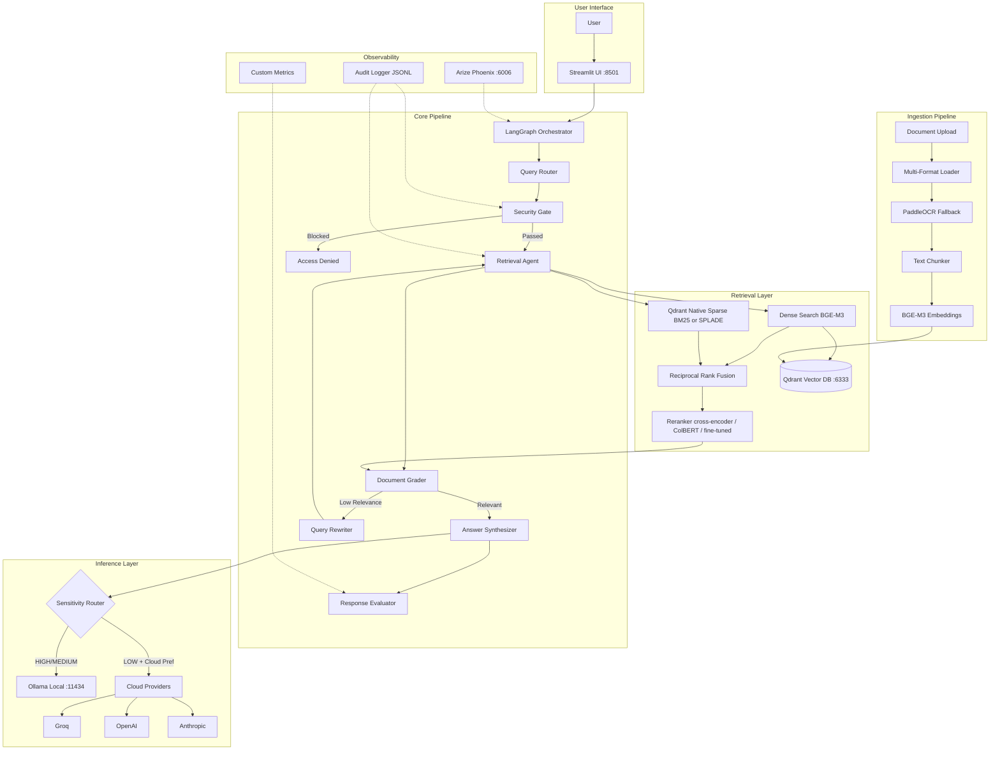
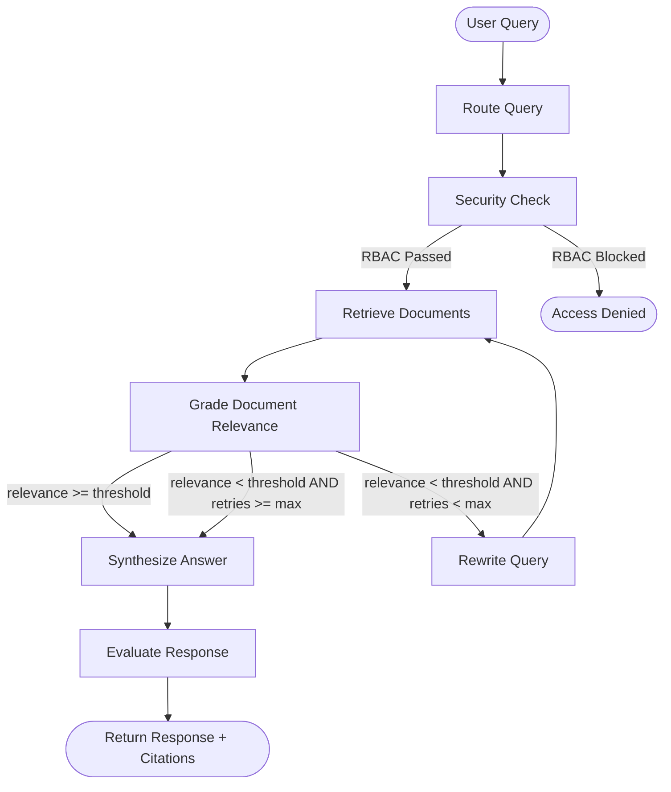
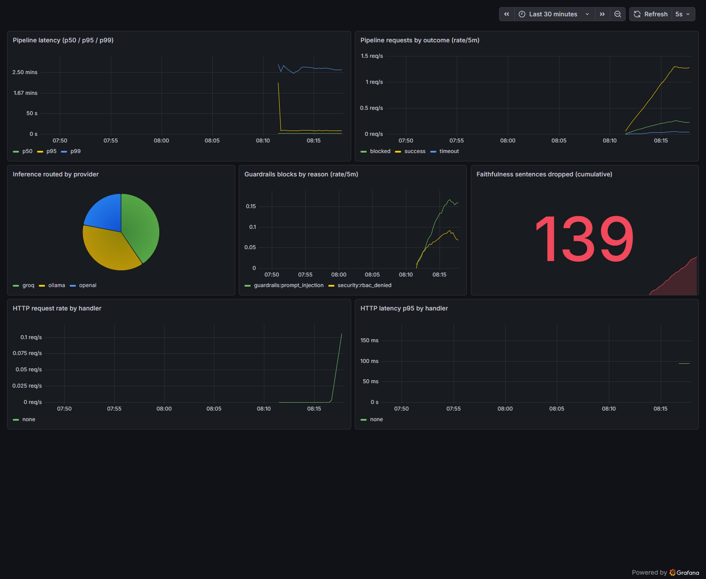

# SecureAgentRAG

> **🚀 Live demo:** [secureagentrag-web.vercel.app](https://secureagentrag-web.vercel.app) · **API:** [`LeomordKaly-secureagentrag-api.hf.space`](https://LeomordKaly-secureagentrag-api.hf.space/healthz) · **Cost:** $0/mo · **Egypt-tested · no credit card · no cold-start delay**
>
> ⚙️ **Production launch shipped + merged to `main`** (2026-05-28, tagged **`v1.0.0-launch`**, CI green). Public BYOK demo on Next.js 16 + Vercel + Hugging Face Spaces + Qdrant Cloud + Groq Free Tier. SSE streaming, session-scoped uploads (dual-collection RRF), persona presets, X-Forwarded-For throttle, audit export, in-chat knowledge-base browser, Markdown answer rendering, 50%+ Groq RPM cut. **623 tests pass** (626 collected, 3 optional-dep skips), **30 ADRs** (24 historical + ADR-025..028 launch + ADR-029 uploads + ADR-030 cost cuts). 101-second demo video at the top of this README. See [`DECISIONS.md`](./DECISIONS.md) ADR-025..030 for the launch architecture.

## 🎬 Demo video (101s)

Real-page walkthrough — RBAC personas, token-by-token streaming, inline citations, the in-chat knowledge base, uploads, and the SHA-256 audit chain. Built with Remotion from live screen captures.

https://github.com/user-attachments/assets/fd464702-9f6f-4fb0-8560-c5513d9adfc6

▶️ **[Full 1080p download](https://github.com/moazmo/secureagentrag/releases/download/v1.0.0-launch/secureagentrag-demo.mp4)** · or **[try it live](https://secureagentrag-web.vercel.app)** yourself.

## What the live demo does

1. **You pick a persona** (engineer / compliance / executive) → RBAC + clearance get applied to every Qdrant search.
2. **You ask a question** → 9 LangGraph nodes run end-to-end with token-by-token SSE streaming.
3. **The UI shows you the proof** — trace pills for every node, citation chips with source/page/score, NLI faithfulness percentage, query rewrite if it fired, SHA-256-chained audit log downloadable as JSONL.
4. **Switch personas + re-ask** → some chunks vanish from the citations panel. That's the RBAC filter at the Qdrant payload layer — same query, different access.

```bash
# Try it locally without paying anything:
curl -X POST https://LeomordKaly-secureagentrag-api.hf.space/byok/chat \
  -H 'Content-Type: application/json' \
  -H 'X-Demo-Persona: compliance' \
  -H 'X-Session-ID: try-it-001' \
  -d '{"query":"What MFA controls does the security policy mandate?","prefer_cloud":true}'
```

<div align="center">

**Privacy-First Multi-Agent RAG with RBAC, Corrective Retrieval, and Hybrid Inference**

[](https://www.python.org/downloads/)
[](LICENSE)
[](docker-compose.yml)
[](https://github.com/astral-sh/ruff)
[](https://github.com/astral-sh/uv)
[](https://github.com/langchain-ai/langgraph)

</div>

---

## Overview

**SecureAgentRAG** is a production-grade Retrieval-Augmented Generation platform built around three core principles: **privacy-first architecture**, **enterprise-grade access control**, and **self-correcting retrieval**. It demonstrates how to build a real-world RAG system that enforces role-based document access at the vector database level, routes sensitive data exclusively through local inference, and automatically refines its retrieval when document relevance is insufficient.

The platform orchestrates a multi-agent workflow via **LangGraph**, where specialized agents handle query routing, security validation, document retrieval, relevance grading, query rewriting, answer synthesis, and response evaluation — forming a corrective loop that retries with refined queries when initial retrieval quality is low. This is not a simple retrieve-and-generate pipeline; it's a stateful graph with conditional branching, cycles, and quality gates.

Designed for deployment on consumer-grade hardware (8GB+ VRAM), SecureAgentRAG uses **Ollama** with quantized **Qwen3-8B** for generation and **BGE-M3** for multilingual embeddings, while maintaining the option to fall back to cloud providers (Groq, OpenAI, Anthropic) for non-sensitive workloads. The system supports **English and Arabic** document processing, with **PaddleOCR** handling scanned documents and images.

---

## The hero story

Most RAG demos retrieve docs and ask an LLM to cite them. SecureAgentRAG goes four steps further — and these are the only things you need to read about the project:

1. **Corrective RAG + NLI citation faithfulness.** Cited sentences are checked back against the source chunk with a local-model entailment pass. Unsupported claims are flagged (`*[unsupported]*`) or dropped. Citation present ≠ claim entailed; we enforce the gap.
2. **RBAC at the vector layer + multi-tenant collections + signed JWT auth.** Qdrant payload filters enforce role/clearance on every search — dense and sparse share the same filter, so the cross-tenant bypass class is structurally impossible. Multi-tenant flag scopes each org to its own collection. HS256 (default) or RS256 + JWKS bearer tokens replace the dev base64 shape; every audit entry carries the `jti`.
3. **Privacy-first hybrid inference.** A sensitivity router forces HIGH-sensitivity work to local Ollama regardless of the caller's `prefer_cloud`. LOW work can opt into Groq / OpenAI / Anthropic. Provenance is recorded in the audit trail.
4. **Tamper-evident audit chain with SLO deadlines.** Every operation lands in a SHA-256 hash-chained JSONL log; the chain verifier detects edits/insertions/deletions. The pipeline respects a configurable wall-clock budget and refuses gracefully on timeout.

One-shot interview demo:

```bash
uv run python -m scripts.interview_demo
# Walks 4 personas through the corpus, blocks a prompt-injection probe,
# verifies the audit chain, exercises the deadline + faithfulness gate.
```

<details>
<summary>Full feature list</summary>

| Feature | Description |
|---------|-------------|
| **Multi-Agent Corrective RAG** | LangGraph workflow: router, guardrails, security, retriever, grader, rewriter, synthesizer, faithfulness, evaluator. Rewrite loop refines the query when relevance drops; the synthesizer refuses instead of synthesizing from off-topic context. Async Postgres / SQLite checkpointer persists thread state. |
| **NLI Faithfulness Gate** | Per-sentence entailment check after synthesis. Annotates or drops unsupported claims. Local model — no extra download. Threshold gates `needs_human_review` and feeds the confidence score. |
| **RBAC at Vector DB Level** | Role + clearance enforced via Qdrant metadata filters; unauthorized docs never returned regardless of similarity. |
| **Multi-Tenant Collections** | Each org optionally gets its own `documents_{org_id}` collection; cross-tenant queries return zero results. Sparse vectors live alongside dense in the same collection under the same RBAC filter — no post-fusion re-check needed. |
| **Signed JWT Auth (HS256 + RS256/JWKS)** | `utils/auth.py` dispatches on `SAR_JWT_ALGORITHM`. HS256 stays the dev default; RS256 mode pulls public keys from `SAR_JWKS_URL` with a TTL cache in `utils/jwks_cache.py`. Keycloak realm export ships under `deploy/keycloak-realm.json`. |
| **Pipeline SLO Deadline** | `SAR_REQUEST_TIMEOUT_S` bounds the whole graph; on overflow the caller gets a graceful refusal + audit entry. |
| **Hybrid Inference Routing** | Sensitivity-based routing forces HIGH to local; LOW/MEDIUM may opt into Groq / OpenAI / Anthropic. Provider + model recorded in audit. |
| **Hybrid Search + Reranking** | Dense (BGE-M3) + Qdrant native sparse vectors (`bm25` default, `splade` opt-in) fused via RRF, then reranker (`none` / `cross_encoder` / `colbert` / `fine_tuned`). Self-query and HyDE retrieval modes available. |
| **Prompt-Injection Guardrails (3 backends)** | Regex always runs first. `SAR_GUARDRAILS_BACKEND` flips escalation between `llm` (legacy SAFE/UNSAFE on qwen3:8b) and `llamaguard` (Meta `llama-guard3:8b`, S1-S14 taxonomy → audit-friendly reason). Fail-open on Ollama transport errors. |
| **True Token Streaming** | Synthesis tokens stream end-to-end. Works for Ollama, Groq, OpenAI, Anthropic. |
| **Arabic + Multilingual** | BGE-M3 multilingual embeddings + PaddleOCR / Qwen-VL OCR for English + Arabic. |
| **Observability** | Structured `structlog`, Phoenix / OpenTelemetry tracing, Prometheus `/metrics` + Grafana dashboard, per-stage latency in the audit trail. |
| **Eval Pipeline + CI Gating** | Ragas faithfulness / relevancy / context-precision; nightly job opens an issue on >5 pp regression. |
| **Prompt-Injection Guardrails** | Dedicated graph node blocks jailbreak / system-prompt-override attempts before retrieval. Output scanned for system-prompt leakage. |
| **Tamper-Evident Audit Chain** | SHA-256 hash chain across audit entries. `scripts/verify_audit_chain.py` detects edits, insertions, and deletions. |
| **PII Redaction** | Email, phone, SSN, credit-card (Luhn-validated), IBAN, IP, API keys scrubbed before audit + query cache. |
| **Contextual Retrieval + HyDE + RAG Fusion** | Opt-in Anthropic-style contextual chunks, hypothetical-document embeddings, multi-query RAG Fusion. |
| **MCP Server + FastAPI** | First-class IDE integration (Claude Desktop / Code / Cursor) and REST API sharing one Pydantic schema. |
| **Cost Dashboard** | $/query for cloud providers + electricity-equivalent for local. Makes the privacy-vs-spend trade-off legible. |

</details>

---

## Architecture



---

## Multi-Agent Workflow

The corrective RAG loop ensures response quality through iterative refinement:



---

## Code Walkthrough

Want to read the code, not the marketing? Follow one query from HTTP entry to cited answer. Anchors are `file::symbol` so they survive line-number drift.

1. **Entry.** A request hits FastAPI at [`interfaces/api.py`](interfaces/api.py) (`/query`, or `/byok/chat` in demo mode). In BYOK mode, [`interfaces/byok.py`](interfaces/byok.py)`::extract_byok` pulls the per-request key, provider, persona, and session ID from headers; the persona maps to an RBAC `UserContext` via `_DEMO_PERSONAS` / `_persona_to_user_ctx` in `api.py`.
2. **Compile + run the graph.** [`core/graph.py`](core/graph.py)`::run_rag_pipeline` wraps `graph.ainvoke()` in an `asyncio.timeout()` SLO budget. The graph itself is built once by `_compose_workflow()` — a 9-node `StateGraph` with conditional edges. State is the `GraphState` TypedDict in [`core/state.py`](core/state.py).
3. **Router.** [`core/agents/router.py`](core/agents/router.py)`::router_node` classifies the query (`simple`/`complex`/`out_of_scope`) and tags sensitivity by regex (no LLM call). All LLM calls in the graph funnel through `call_llm_async` / `call_llm_with_decision` here.
4. **Guardrails → security.** [`core/agents/guardrails.py`](core/agents/guardrails.py) runs regex injection patterns first, then optionally escalates to `llm` or `llamaguard` ([`guardrails_llamaguard.py`](core/agents/guardrails_llamaguard.py)). [`core/agents/security.py`](core/agents/security.py) applies the RBAC clearance gate (fail-closed on LLM error).
5. **Retrieve (the RBAC payload filter).** [`core/agents/retriever.py`](core/agents/retriever.py) calls [`retrieval/hybrid_search.py`](retrieval/hybrid_search.py), which fuses dense (BGE-M3) + Qdrant native sparse via RRF. **The access-control invariant lives in** [`retrieval/qdrant_client.py`](retrieval/qdrant_client.py)`::build_rbac_filter` — `org_id` + `sensitivity_level_int ≤ clearance` + `roles` match-any, applied to dense *and* sparse under one filter, so cross-tenant bypass is structurally impossible.
6. **Grade → rewrite loop.** The grader (in `retriever.py`) scores relevance; if it's below `SAR_RELEVANCE_THRESHOLD` and retries remain, the rewriter (in `router.py`) reformulates and the graph loops back to retrieve.
7. **Synthesize.** [`core/agents/synthesizer.py`](core/agents/synthesizer.py) generates the answer with inline `[N]` citations, streaming tokens via LangGraph custom events. The provider is chosen by [`inference/router.py`](inference/router.py)`::route` — HIGH sensitivity → local Ollama unless `SAR_ALLOW_CLOUD_FOR_HIGH` (see [privacy trade-offs](docs/BYOK_PRIVACY_TRADEOFFS.md)).
8. **Faithfulness → evaluate.** [`core/agents/faithfulness.py`](core/agents/faithfulness.py) runs a per-sentence NLI entailment check on each cited sentence and flags/drops unsupported ones. [`core/agents/evaluator.py`](core/agents/evaluator.py) sets `needs_human_review` and the confidence score.
9. **Audit.** Every node and every API call lands in the SHA-256 hash-chained log via [`utils/audit.py`](utils/audit.py), PII-redacted first by [`utils/pii.py`](utils/pii.py). Verify integrity with `scripts/verify_audit_chain.py`.

Full env-var reference: [`docs/configuration.md`](docs/configuration.md). Deeper diagrams: [`architecture.md`](architecture.md).

---

## Metrics & Dashboards

Two complementary observability layers, both **self-hosted** (the public BYOK demo runs neither — see the privacy note below):

- **Tracing** — Arize Phoenix / OpenTelemetry captures per-LLM-call spans (prompts, completions, latency). Enabled with `SAR_PHOENIX_ENDPOINT`.
- **Metrics** — Prometheus counters + histograms exposed at `GET /metrics`, scraped into Grafana.

The metrics layer ([`utils/metrics.py`](utils/metrics.py)) emits four custom RAG signals on top of the standard HTTP request metrics from `prometheus-fastapi-instrumentator`:

| Metric | Type | Labels | Meaning |
|--------|------|--------|---------|
| `rag_pipeline_latency_seconds` | histogram | `outcome` | End-to-end pipeline wall-clock, bucketed to the 180 s SLO |
| `rag_pipeline_requests_total` | counter | `outcome` | Runs by terminal outcome (`success` / `blocked` / `timeout` / `review`) |
| `guardrails_blocked_total` | counter | `gate`, `reason` | Requests stopped at a safety gate, by reason category |
| `inference_routed_by_provider_total` | counter | `provider` | Synthesis calls by provider (`ollama` / `groq` / `openai` / `anthropic`) |
| `faithfulness_dropped_total` | counter | — | Cited sentences the NLI gate flagged/dropped |

Bring the stack up on top of the base compose:

```bash
docker compose -f docker-compose.yml -f docker-compose.observability.yml up
# Grafana    → http://localhost:3000  (admin / admin) → "SecureAgentRAG — RAG Pipeline"
# Prometheus → http://localhost:9090
# API        → http://localhost:8000/metrics
```

Grafana auto-provisions the Prometheus datasource and the dashboard from [`deploy/grafana/`](deploy/grafana/); Prometheus scrape config is [`deploy/prometheus.yml`](deploy/prometheus.yml).



> **Privacy by design.** Metrics are aggregate counters only — no prompt, completion, key, or user text ever lands in a label, so they are safe even under BYOK. The public Hugging Face Space (CPU Basic) ships **without** the `[metrics]` extra and runs no collector; `/metrics` there is a 501 no-op. Phoenix tracing is *hard-disabled* under BYOK regardless of config, since spans would capture request content.

---

## Tech Stack

| Category | Technology | Why |
|----------|-----------|-----|
| **Orchestration** | LangGraph | First-class support for cycles, conditional edges, and stateful multi-agent workflows |
| **Vector Store** | Qdrant | Native payload filtering enables RBAC at DB level; production-grade with gRPC API |
| **LLM (Local)** | Ollama + Qwen3-8B | Multilingual, fits in 8GB VRAM (Q4_K_M), Apache 2.0 license |
| **Embeddings** | BGE-M3 (1024d) | State-of-the-art multilingual dense embeddings supporting 100+ languages |
| **Sparse Search** | Qdrant native sparse vectors (`bm25` / `splade`) | Same RBAC filter as dense — cross-tenant BM25 bypass is structurally impossible |
| **Reranking** | Cross-encoder / ColBERTv2 / fine-tuned domain checkpoint | Four-mode factory (`none` / `cross_encoder` / `colbert` / `fine_tuned`) selected by `SAR_RERANKER_TYPE` |
| **OCR** | PaddleOCR | High-accuracy multilingual OCR for scanned documents and images |
| **UI (local dev)** | Streamlit | Rapid prototyping with rich interactive widgets (chat, file upload, admin) |
| **UI (public demo)** | Next.js 16 + Tailwind v4 + SSE streaming | Production-grade BYOK demo on Vercel Hobby — `secureagentrag-web.vercel.app` |
| **Backend host (public demo)** | Hugging Face Spaces Docker CPU Basic | $0/mo, 16 GB RAM, 48 h sleep defeated by GitHub Actions cron — ADR-026 |
| **Vector store (public demo)** | Qdrant Cloud Free Tier (1 GB) | Always-on, sparse + dense, AWS us-east-1 — ADR-028 |
| **LLM (public demo)** | Groq Free Tier (`llama-3.1-8b-instant`) | 14,400 RPD, 30 RPM, per-IP throttle + visitor BYOK unlock — ADR-030 |
| **Observability** | Arize Phoenix + Prometheus/Grafana + structlog | OpenTelemetry tracing + aggregate RAG metrics dashboard + structured JSON logging |
| **Evaluation** | Ragas + Custom Metrics | Industry-standard RAG metrics with custom latency/confidence tracking |
| **Package Manager** | uv | 10-100x faster than pip/Poetry; Rust-based with native lockfile support |
| **Containerization** | Docker Compose | One-command deployment for Qdrant, Ollama, and the application |

---

## Quick Start

### Prerequisites

- **Python 3.11+**
- **Docker** & Docker Compose
- **Ollama** ([install guide](https://ollama.ai/))
- **NVIDIA GPU** with 8GB+ VRAM (recommended) or CPU-only mode
- **uv** package manager ([install guide](https://github.com/astral-sh/uv))

### Installation

```bash
# Clone the repository
git clone https://github.com/moazmo/secureagentrag.git
cd secureagentrag

# Install dependencies with uv
pip install uv
uv sync

# Start infrastructure (Qdrant vector DB + Ollama)
docker-compose up -d qdrant

# Pull required models
ollama pull qwen3:8b
ollama pull bge-m3

# Configure environment
cp .env.example .env
# Edit .env if you want to enable cloud providers or Phoenix tracing

# Launch the application
uv run streamlit run app/main.py
```

The application will be available at **http://localhost:8501**.

### Full Docker Deployment

```bash
# Build and start all services (Qdrant + Ollama + App)
docker-compose up --build
```

---

## VRAM Optimization Guide

SecureAgentRAG is designed to run on consumer-grade GPUs. Here are recommended configurations:

### 8GB VRAM (e.g., RTX 3060, RTX 4060)

| Model | Quantization | VRAM | Purpose |
|-------|-------------|------|---------|
| Qwen3-8B | Q4_K_M | ~5.5 GB | Generation |
| BGE-M3 | FP16 | ~1.2 GB | Embeddings |
| **Total** | | **~6.7 GB** | Fits with headroom |

```bash
# Recommended: Run embedding model with reduced GPU layers
ollama pull qwen3:8b    # Q4_K_M by default
ollama pull bge-m3
```

### 12GB VRAM (e.g., RTX 3060 12GB, RTX 4070)

| Model | Quantization | VRAM | Purpose |
|-------|-------------|------|---------|
| Qwen3-8B | Q5_K_M | ~6.5 GB | Higher quality generation |
| BGE-M3 | FP16 | ~1.2 GB | Embeddings |
| **Total** | | **~7.7 GB** | Comfortable headroom |

### 16GB+ VRAM (e.g., RTX 4080, RTX 4090)

| Model | Quantization | VRAM | Purpose |
|-------|-------------|------|---------|
| Qwen3-8B | Q8_0 | ~9.0 GB | Maximum quality |
| BGE-M3 | FP16 | ~1.2 GB | Embeddings |
| Cross-Encoder | FP16 | ~0.5 GB | Reranking |
| **Total** | | **~10.7 GB** | Full pipeline on GPU |

### Optimization Tips

- **Reduce context length**: Set `num_ctx=2048` in Ollama modelfile to reduce KV cache memory
- **CPU embeddings**: Run BGE-M3 on CPU if VRAM is tight (`OLLAMA_NUM_GPU=0` for embedding)
- **Concurrent loading**: Ollama can keep multiple models loaded — set `OLLAMA_MAX_LOADED_MODELS=2`
- **Quantization tradeoff**: Q4_K_M offers best balance of quality vs. memory; Q4_0 is smallest but lower quality

---

## Project Structure

```
secureagentrag/
├── app/                        # Streamlit UI application
│   ├── main.py                 # Application entry point & page config
│   ├── pages/                  # Multi-page navigation
│   │   ├── chat.py             # Chat interface with streaming
│   │   ├── upload.py           # Document upload & ingestion
│   │   ├── audit.py            # Audit log viewer
│   │   └── evaluation.py       # Metrics dashboard
│   └── components/             # Reusable UI widgets
│       ├── chat_message.py     # Chat bubble component
│       └── sidebar.py          # Navigation sidebar
├── core/                       # LangGraph multi-agent orchestration
│   ├── graph.py                # Graph compilation & execution
│   ├── state.py                # TypedDict state schema
│   └── agents/                 # Specialized agent nodes
│       ├── router.py           # Query classification & routing
│       ├── security.py         # RBAC security gate
│       ├── retriever.py        # Document retrieval & grading
│       ├── synthesizer.py      # Answer generation with citations
│       └── evaluator.py        # Response quality evaluation
├── ingestion/                  # Document processing pipeline
│   ├── pipeline.py             # End-to-end ingestion orchestrator
│   ├── loaders.py              # Multi-format document loaders
│   ├── chunker.py              # Custom text chunking (no LangChain dep)
│   ├── metadata.py             # RBAC metadata & sensitivity tagging
│   └── ocr.py                  # PaddleOCR integration
├── retrieval/                  # Hybrid search & reranking
│   ├── hybrid_search.py        # Dense + BM25 + RRF fusion
│   ├── qdrant_client.py        # Qdrant operations with RBAC filters
│   ├── embeddings.py           # BGE-M3 embedding service
│   └── reranker.py             # Cross-encoder reranking
├── inference/                  # LLM provider abstraction
│   ├── llm_factory.py          # Unified LLM interface & factory
│   ├── router.py               # Sensitivity-based inference routing
│   ├── ollama_client.py        # Ollama local inference client
│   └── cloud_clients.py        # Groq, OpenAI, Anthropic clients
├── evaluation/                 # Quality assessment & metrics
│   ├── ragas_eval.py           # Ragas evaluation pipeline
│   ├── custom_metrics.py       # Custom latency/confidence metrics
│   └── dashboard.py            # Streamlit dashboard data layer
├── config/                     # Application configuration
│   └── settings.py             # Pydantic settings (env vars)
├── utils/                      # Cross-cutting concerns
│   ├── logging.py              # Structured logging (structlog)
│   ├── audit.py                # Audit trail with JSONL persistence
│   └── observability.py        # Phoenix/OpenTelemetry tracing
├── tests/                      # Pytest test suite
│   ├── test_agents/            # Agent unit tests
│   ├── test_inference/         # Inference layer tests
│   ├── test_ingestion/         # Ingestion pipeline tests
│   ├── test_retrieval/         # Retrieval layer tests
│   └── conftest.py             # Shared fixtures
├── sample_docs/                # Example documents for testing
│   ├── sample_english.txt      # English corporate policy
│   ├── sample_arabic.txt       # Arabic privacy policy
│   └── sample_mixed.txt        # Bilingual document
├── docker-compose.yml          # Qdrant + Ollama + App services
├── Dockerfile                  # Application container image
├── pyproject.toml              # Project metadata & dependencies
├── .env.example                # Environment variable template
├── architecture.md             # Detailed architecture documentation
└── DECISIONS.md                # Architecture Decision Records
```

---

## RBAC Security Model

SecureAgentRAG enforces access control at the **vector database level**, making it impossible to bypass through application bugs:

### How It Works

1. **Ingestion**: Documents are tagged with allowed roles and sensitivity level in Qdrant payload metadata
2. **Query Time**: User's roles are resolved and injected as Qdrant filter conditions
3. **Enforcement**: Qdrant only returns vectors matching the user's access level — unauthorized documents are never retrieved

### Example

```python
# Document ingested with metadata:
{
    "text": "Q3 Revenue: $4.2M...",
    "roles": ["finance_manager", "executive", "admin"],
    "sensitivity_level": "high",
    "org_id": "acme_corp",
    "department": "finance"
}

# User with role "engineer" queries about revenue:
# → Qdrant filter: {"roles": {"$in": ["engineer"]}}
# → Result: Document NOT returned (role mismatch)
# → User never sees the finance data

# User with role "finance_manager" queries:
# → Qdrant filter: {"roles": {"$in": ["finance_manager"]}}
# → Result: Document IS returned
# → Inference routed to LOCAL only (HIGH sensitivity)
```

---

## Evaluation & Benchmarks

### Target Metrics

| Metric | Target | Description |
|--------|--------|-------------|
| Context Precision | > 0.85 | Retrieved documents are relevant to the query |
| Faithfulness | > 0.90 | Generated answer is grounded in retrieved contexts |
| Answer Relevancy | > 0.85 | Response directly addresses the user's question |
| Context Recall | > 0.80 | All relevant information is retrieved |
| P90 Latency | < 3s | 90th percentile end-to-end response time |

### Running Evaluation

```bash
# Run with ragas (requires `uv sync --extra evaluation`)
uv run python -m evaluation.ragas_eval

# Run performance benchmarks (requires Ollama + Qdrant + ingested docs)
uv run python -m evaluation.benchmark

# Custom metrics are collected automatically during queries
# View in the Streamlit Evaluation dashboard
```

### Benchmark Methodology

Benchmarks measure end-to-end pipeline latency (query → response) across query types:

```bash
# Run the short-form benchmark suite (requires Ollama + Qdrant running with docs ingested)
uv run python -m scripts.quick_bench
```

The benchmark script (`scripts/quick_bench.py`) measures:
- **End-to-end latency**: Total time from query submission to response
- **Per-node latency**: Router, retriever, grader, synthesizer, evaluator
- **Retrieval quality**: Relevance ratio after grading
- **Confidence distribution**: Scores across query types

**Measured Performance — Local Only** (2026-05-19 on RTX 3060 12GB with qwen3:8b Q4_K_M + bge-m3, 5 queries/type):

| Metric | Simple | Complex |
|--------|--------|---------|
| Mean latency | 67.9 s | 126.3 s |
| P50 latency | 66.6 s | 113.9 s |
| P90 latency | 84.7 s | 201.6 s |
| Mean confidence | 0.923 | 0.823 |
| Mean relevance | 0.64 | 0.38 |
| Mean retries | 0.2 | 1.0 |

**Measured Performance — Cloud Routed** (Groq llama-3.3-70b-versatile, 3 queries, `SAR_CLOUD_PROVIDER=groq`):

| Metric | Cloud | Notes |
|--------|-------|-------|
| Mean latency | 24.6 s | Embedding + security still local |
| LLM-only latency | ~1.2 s | Groq generation calls |
| Mean confidence | 0.896 | Comparable to local |

**Measured Performance — Arabic (Cloud)** (Groq, 3 Arabic queries):

| Metric | Value |
|--------|-------|
| Mean latency | 12.1 s |
| Mean confidence | 0.659 |

The cloud router reduces LLM generation time from ~10-40s (Ollama) to ~0.3-2s (Groq), but embeddings (bge-m3 via Ollama) and the security node (forced local for HIGH sensitivity) remain on-device. Use `uv run python -m scripts.cloud_bench --quick` (English) or `uv run python -m scripts.arabic_bench` (Arabic) to reproduce.

**Recommended Benchmark Setup**
- **Hardware**: RTX 3060 12GB or equivalent
- **Model**: qwen3:8b (Q4_K_M, ~5.5GB VRAM)
- **Embedding**: bge-m3 (1024d, ~1.2GB VRAM)
- **Document corpus**: 100-1000 chunks for realistic retrieval
- **Warmup**: 1 query to warm caches before measurement
- **Runs**: 10 queries per type, report mean/median/P90

*Measured with `uv run python -m scripts.quick_bench` (local) and `uv run python -m scripts.cloud_bench --quick` (cloud) on the NIST AI RMF corpus (147 chunks).*

---

## Configuration

All settings are managed via environment variables (prefix: `SAR_`). The table below is a curated subset — the **full canonical reference (every variable, grouped, with the exact names pydantic reads) is in [`docs/configuration.md`](docs/configuration.md)**.

| Variable | Default | Description |
|----------|---------|-------------|
| `SAR_DEBUG` | `false` | Enable debug mode (pretty console logs) |
| `SAR_LOG_LEVEL` | `INFO` | Logging level (DEBUG, INFO, WARNING, ERROR) |
| `SAR_QDRANT_URL` | `http://localhost:6333` | Qdrant server URL |
| `SAR_QDRANT_COLLECTION` | `documents` | Default collection name |
| `SAR_OLLAMA_URL` | `http://localhost:11434` | Ollama server URL |
| `SAR_LLM_MODEL` | `qwen3:8b` | Default generation model |
| `SAR_EMBEDDING_MODEL` | `bge-m3` | Embedding model |
| `SAR_EMBEDDING_DIM` | `1024` | Embedding vector dimension |
| `SAR_CHUNK_SIZE` | `1000` | Text chunk size (characters) |
| `SAR_CHUNK_OVERLAP` | `200` | Overlap between chunks |
| `SAR_TOP_K` | `10` | Initial retrieval count |
| `SAR_RERANK_TOP_K` | `5` | Results after reranking |
| `SAR_RELEVANCE_THRESHOLD` | `0.7` | Minimum relevance score |
| `SAR_DEFAULT_PROVIDER` | `ollama` | Default LLM provider |
| `SAR_CLOUD_PROVIDER` | — | Preferred cloud provider |
| `SAR_GROQ_API_KEY` | — | Groq API key |
| `SAR_OPENAI_API_KEY` | — | OpenAI API key |
| `SAR_ANTHROPIC_API_KEY` | — | Anthropic API key |
| `SAR_ENABLE_RBAC` | `true` | Enable RBAC enforcement |
| `SAR_PHOENIX_ENDPOINT` | — | Arize Phoenix collector URL |
| `SAR_JWT_ALGORITHM` | `HS256` | `HS256` (dev/HMAC) or `RS256` (production, JWKS) |
| `SAR_JWKS_URL` | — | IdP JWKS endpoint when `SAR_JWT_ALGORITHM=RS256` |
| `SAR_JWKS_CACHE_TTL_SECONDS` | `300` | TTL for cached JWKS public keys |
| `SAR_SPARSE_BACKEND` | `bm25` | `bm25` (default, no deps) or `splade` (needs `[embeddings-local]`) |
| `SAR_RERANKER_TYPE` | `cross_encoder` | `none` / `cross_encoder` / `colbert` / `fine_tuned` |
| `SAR_FINETUNED_RERANKER_PATH` | `data/checkpoints/reranker-domain-v1` | Local checkpoint dir when `SAR_RERANKER_TYPE=fine_tuned` |
| `SAR_GUARDRAILS_STRICT` | `false` | Enable escalation past the regex gate |
| `SAR_GUARDRAILS_BACKEND` | `llm` | `llm` (legacy) or `llamaguard` (S1-S14 classifier) |
| `SAR_LLAMAGUARD_MODEL` | `llama-guard3:8b` | Ollama tag for the LlamaGuard backend |
| `SAR_FAITHFULNESS_GATE_ENABLED` | `false` | Per-sentence NLI entailment gate after synthesis |
| `SAR_FAITHFULNESS_GATE_MODE` | `flag` | `flag` (annotate) or `drop` (remove unsupported sentences) |
| `SAR_FAITHFULNESS_THRESHOLD` | `0.7` | Min entailment score before a sentence counts as supported |
| `SAR_REQUEST_TIMEOUT_S` | `60` | Wall-clock SLO budget for one pipeline run (`0` disables) |

### BYOK production mode (ADR-025 + ADR-030)

The HF Space Dockerfile sets these. They change the meaning of the pipeline — read the ADRs before flipping.

| Variable | Default (prod) | Description |
|----------|----------------|-------------|
| `SAR_BYOK_MODE` | `true` | Master gate: enables per-request key extraction + session collections + cost-cut toggles |
| `SAR_BYOK_OWNER_KEY_QUOTA_PER_HOUR` | `10` | Owner-key per-IP throttle |
| `SAR_SESSION_COLLECTION_TTL_HOURS` | `24` | Auto-purge cutoff for `documents_sess_<sid>` collections |
| `SAR_CORS_ALLOW_ORIGINS` | Vercel URL allowlist | CORS origins (JSON array) |
| `SAR_BYOK_AUDIT_MAX_ENTRIES` | `50` | Cap on `/byok/audit` response size |
| `SAR_BYOK_UPLOAD_MAX_BYTES` | `5242880` (5 MB) | Per-file upload cap |
| `SAR_BYOK_UPLOAD_MAX_FILES` | `5` | Per-session file cap |
| `SAR_BYOK_UPLOAD_MAX_CHUNKS_PER_FILE` | `60` | Reject chatty PDFs |
| `SAR_BYOK_UPLOAD_ALLOWED_EXTENSIONS` | `[".txt",".md",".pdf"]` | Upload MIME allowlist |
| `SAR_BYOK_SKIP_GRADER` | `true` | Bypass per-doc LLM grader (cost) |
| `SAR_BYOK_SKIP_EVALUATOR` | `true` | Bypass evaluator LLM, use heuristic confidence (cost) |
| `SAR_GROQ_MODEL` | `llama-3.1-8b-instant` | Pin model (don't default-drift to 70b) |
| `SAR_RAG_FUSION_ENABLED` | `false` | Disabled for cost (no measurable gain on small corpus) |
| `SAR_FAITHFULNESS_GATE_ENABLED` | `false` | Disabled for cost; self-hosted flips back |
| `SAR_RERANKER_TYPE` | `none` | Disabled for CPU Basic disk + small corpus |
| `SAR_RELEVANCE_THRESHOLD` | `0.55` | Loose to keep small-corpus answers flowing |
| `SAR_MAX_RETRIES` | `1` | One refine is enough |
| `SAR_ALLOW_CLOUD_FOR_HIGH` | `true` (prod) | HF Space has no Ollama; HIGH unlocks cloud with UI badge |

> **Self-hosted users:** leave `SAR_BYOK_MODE=false` (default) and the platform behaves exactly as documented above — full faithfulness gate, LLM evaluator, LlamaGuard escalation, RBAC + sensitivity routing with HIGH-stays-local.

---

## Development

### Running Tests

```bash
# Run full test suite
uv run pytest

# Run with coverage
uv run pytest --cov=. --cov-report=html

# Run specific test module
uv run pytest tests/test_agents/ -v

# Skip slow/integration tests
uv run pytest -m "not slow and not integration"
```

### Code Quality

```bash
# Lint and format
uv run ruff check .
uv run ruff format .

# Type checking (optional)
uv run mypy . --ignore-missing-imports
```

### Adding Dependencies

```bash
uv add <package-name>
uv add --dev <dev-package-name>
```

---

## Architectural Decisions

Key design choices are documented in [DECISIONS.md](DECISIONS.md). Highlights:

| ADR | Decision | Rationale |
|-----|----------|-----------|
| ADR-001 | uv over Poetry | 10-100x faster resolution, Rust-based, PEP 621 native |
| ADR-002 | Qdrant over Chroma | Native payload filtering for RBAC; production-grade |
| ADR-003 | LangGraph over LangChain agents | First-class cycles, conditional edges, state management |
| ADR-004 | Qwen3-8B default | Multilingual, 8GB VRAM, Apache 2.0, strong reasoning |
| ADR-005 | RBAC at vector DB level | Defense-in-depth; impossible to bypass via app bugs |
| ADR-006 | Streamlit-first (FastAPI optional) | Faster development, rich UI, lower complexity |
| ADR-007 | Custom chunker | No LangChain dependency for text splitting |
| ADR-008 | Hybrid search with RRF | Combines semantic + lexical for better recall |
| ADR-009 | Conditional imports | Optional deps (PaddleOCR, ragas) don't break core |
| ADR-010 | Sensitivity-based routing | Privacy enforcement through inference provider selection |
| ADR-011 | Tamper-evident audit chain | SHA-256 prev_hash makes log edits / deletes detectable |
| ADR-012 | Prompt-injection guardrails node | Block jailbreaks before they spend embedding / LLM budget |
| ADR-013 | Contextual Retrieval (Anthropic) | Prepend LLM context to each chunk → 35-49% recall lift |
| ADR-014 | HyDE for hard queries | Hypothetical answer lands in doc-space, improves dense recall |
| ADR-015 | MCP + FastAPI surfaces | IDE agents (MCP) + external services (REST) share schemas |
| ADR-016 | PII redaction before persistence | Audit / cache never see raw PII; live state untouched |
| ADR-017 | Cost model for local vs cloud | Dashboard makes the privacy / spend trade-off legible |
| ADR-018 | AsyncPostgresSaver + Windows selector pin | LangGraph checkpointer runs in the same async loop as the pipeline |
| ADR-019 | HS256 + RS256/JWKS dispatch | Public-key verification against any OIDC provider via `SAR_JWT_ALGORITHM` flip |
| ADR-020 | Qdrant native sparse vectors over `rank_bm25` pickle | Sparse runs under the same RBAC filter — cross-tenant bypass structurally impossible |
| ADR-021 | LlamaGuard 3 as drop-in escalation backend | Purpose-built classifier with S1-S14 taxonomy via `llama-guard3:8b` over Ollama |
| ADR-022 | Fine-tuned domain reranker as opt-in checkpoint | Training + bench scripts in tree; flip `SAR_RERANKER_TYPE=fine_tuned` after training |
| ADR-023 | Threshold calibration against labelled gold set | Data-driven confidence + faithfulness thresholds via `evaluation/calibration.json` |
| ADR-024 | Per-tenant SPLADE isolation + manager cache | `QdrantManager.for_org()` caches per-tenant managers; sparse isolation pinned by regression tests |
| ADR-025 | BYOK demo mode | Per-request key extraction + session collections + per-IP throttle + persona presets |
| ADR-026 | Hugging Face Spaces as backend host | $0/mo, 16 GB RAM, 48 h sleep defeated by cron |
| ADR-027 | Vercel + Next.js 16 frontend | SSE streaming, BYOK drawer + localStorage, eye-comfort palette |
| ADR-028 | Qdrant Cloud + session collections | Always-on 1 GB free tier; 24 h auto-purge of `documents_sess_<sid>` |
| ADR-029 | BYOK document uploads + dual-collection RRF | 5 MB / 5 files / 60 chunks; structurally impossible cross-session leakage |
| ADR-030 | Free-tier Groq cost optimisations | Pin 8b-instant + bypass evaluator/grader/RAG-fusion/faithfulness/reranker — ~2 calls/chat vs 5–6 |

---

## Status

Production-ready and **live**. The public BYOK demo runs at $0/month on Vercel + Hugging Face Spaces + Qdrant Cloud + Groq Free Tier; **623 tests** pass in CI; **30 ADRs** document every decision in [DECISIONS.md](DECISIONS.md). Tagged [`v1.0.0-launch`](https://github.com/moazmo/secureagentrag/releases/tag/v1.0.0-launch). Full feature breadth is in the feature table above and the ADR list below.

## License

MIT License — see [LICENSE](LICENSE) for details.

---

## Author

Built by **Moaz Muhammad** — [GitHub](https://github.com/moazmo)
