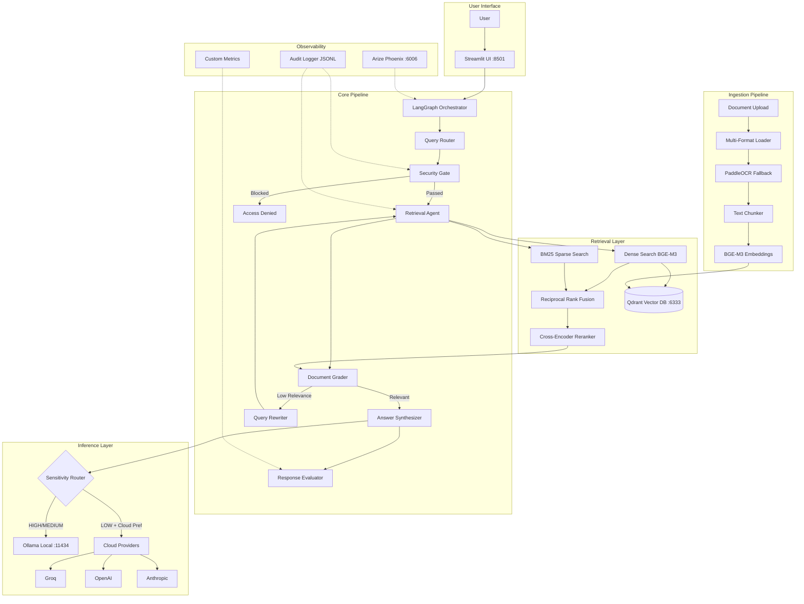

# SecureAgentRAG

<div align="center">

**Privacy-First Multi-Agent RAG with RBAC, Corrective Retrieval, and Hybrid Inference**

[](https://www.python.org/downloads/)
[](LICENSE)
[](docker-compose.yml)
[](https://github.com/astral-sh/ruff)
[](https://github.com/astral-sh/uv)
[](https://github.com/langchain-ai/langgraph)

</div>

---

## Overview

**SecureAgentRAG** is a production-grade Retrieval-Augmented Generation platform built around three core principles: **privacy-first architecture**, **enterprise-grade access control**, and **self-correcting retrieval**. It demonstrates how to build a real-world RAG system that enforces role-based document access at the vector database level, routes sensitive data exclusively through local inference, and automatically refines its retrieval when document relevance is insufficient.

The platform orchestrates a multi-agent workflow via **LangGraph**, where specialized agents handle query routing, security validation, document retrieval, relevance grading, query rewriting, answer synthesis, and response evaluation — forming a corrective loop that retries with refined queries when initial retrieval quality is low. This is not a simple retrieve-and-generate pipeline; it's a stateful graph with conditional branching, cycles, and quality gates.

Designed for deployment on consumer-grade hardware (8GB+ VRAM), SecureAgentRAG uses **Ollama** with quantized **Qwen3-8B** for generation and **BGE-M3** for multilingual embeddings, while maintaining the option to fall back to cloud providers (Groq, OpenAI, Anthropic) for non-sensitive workloads. The system supports **English and Arabic** document processing, with **PaddleOCR** handling scanned documents and images.

---

## Key Features

| Feature | Description |
|---------|-------------|
| **Multi-Agent Corrective RAG** | LangGraph-orchestrated workflow with router, retriever, grader, rewriter, synthesizer, and evaluator agents. Automatic query refinement when relevance drops below threshold. SQLite checkpointer persists thread state across restarts. |
| **RBAC at Vector DB Level** | Role-based access control enforced via Qdrant metadata filters — unauthorized documents are never returned regardless of semantic similarity. |
| **Hybrid Inference Routing** | Sensitivity-based routing ensures HIGH-sensitivity data never leaves local infrastructure. Cloud fallback available for low-sensitivity workloads. |
| **Hybrid Search + Reranking** | Dense retrieval (BGE-M3) combined with BM25 sparse search via Reciprocal Rank Fusion, followed by cross-encoder reranking for maximum relevance. |
| **True Token Streaming** | Synthesis tokens stream from the LLM through the pipeline to the UI — no fake post-hoc word-by-word replay. Works for Ollama, Groq, OpenAI, Anthropic. |
| **Arabic + Multilingual Support** | BGE-M3 multilingual embeddings + PaddleOCR for bilingual document processing (English/Arabic). |
| **Production Observability** | Structured logging (structlog), distributed tracing (Arize Phoenix/OpenTelemetry), and comprehensive audit trail with JSONL persistence. |
| **Evaluation Pipeline** | Ragas metrics (faithfulness, relevancy, context precision/recall) + custom latency/confidence/RBAC tracking with Streamlit dashboard. |
| **Privacy-First Architecture** | All data stays local by default. Cloud providers are opt-in fallbacks, never the default path for sensitive data. |
| **VRAM-Optimized** | Runs on 8GB GPUs with quantized models. Designed for consumer hardware without sacrificing capability. |
| **Prompt-Injection Guardrails** | Dedicated graph node blocks jailbreak / system-prompt-override attempts before they spend embedding or LLM budget. Output also scanned for system-prompt leakage. |
| **Tamper-Evident Audit Chain** | SHA-256 hash chain across all audit entries. `scripts/verify_audit_chain.py` detects edits, insertions, or deletions. |
| **PII Redaction** | Email, phone, SSN, credit-card (Luhn-validated), IBAN, IP, and API keys are scrubbed before audit log + query cache persistence. Live in-flight state untouched. |
| **Contextual Retrieval & HyDE** | Opt-in Anthropic-style contextual chunks and hypothetical-document embeddings for measurable recall gains on complex queries. |
| **MCP Server + FastAPI** | First-class IDE integration (Claude Desktop / Code / Cursor) and REST API — both share the same `QueryResponse` Pydantic schema. |
| **Cost Dashboard** | $/query for Groq / OpenAI / Anthropic + electricity-equivalent for local. Makes the privacy-vs-spend trade-off legible at a glance. |
| **CI Eval Gating** | Nightly Ragas evaluation against a golden Q/A set; > 5 pp regression on faithfulness or context_precision opens an issue. |

---

## Architecture



---

## Multi-Agent Workflow

The corrective RAG loop ensures response quality through iterative refinement:


---

## Tech Stack

| Category | Technology | Why |
|----------|-----------|-----|
| **Orchestration** | LangGraph | First-class support for cycles, conditional edges, and stateful multi-agent workflows |
| **Vector Store** | Qdrant | Native payload filtering enables RBAC at DB level; production-grade with gRPC API |
| **LLM (Local)** | Ollama + Qwen3-8B | Multilingual, fits in 8GB VRAM (Q4_K_M), Apache 2.0 license |
| **Embeddings** | BGE-M3 (1024d) | State-of-the-art multilingual dense embeddings supporting 100+ languages |
| **Sparse Search** | BM25 (rank-bm25) | Lexical matching to complement semantic search via Reciprocal Rank Fusion |
| **Reranking** | Cross-Encoder | Precision reranking of top-K results for maximum relevance |
| **OCR** | PaddleOCR | High-accuracy multilingual OCR for scanned documents and images |
| **UI** | Streamlit | Rapid prototyping with rich interactive widgets (chat, file upload, admin) |
| **Observability** | Arize Phoenix + structlog | OpenTelemetry-compatible distributed tracing + structured JSON logging |
| **Evaluation** | Ragas + Custom Metrics | Industry-standard RAG metrics with custom latency/confidence tracking |
| **Package Manager** | uv | 10-100x faster than pip/Poetry; Rust-based with native lockfile support |
| **Containerization** | Docker Compose | One-command deployment for Qdrant, Ollama, and the application |

---

## Quick Start

### Prerequisites

- **Python 3.11+**
- **Docker** & Docker Compose
- **Ollama** ([install guide](https://ollama.ai/))
- **NVIDIA GPU** with 8GB+ VRAM (recommended) or CPU-only mode
- **uv** package manager ([install guide](https://github.com/astral-sh/uv))

### Installation

```bash
# Clone the repository
git clone https://github.com/moazmo/secureagentrag.git
cd secureagentrag

# Install dependencies with uv
pip install uv
uv sync

# Start infrastructure (Qdrant vector DB + Ollama)
docker-compose up -d qdrant

# Pull required models
ollama pull qwen3:8b
ollama pull bge-m3

# Configure environment
cp .env.example .env
# Edit .env if you want to enable cloud providers or Phoenix tracing

# Launch the application
uv run streamlit run app/main.py
```

The application will be available at **http://localhost:8501**.

### Full Docker Deployment

```bash
# Build and start all services (Qdrant + Ollama + App)
docker-compose up --build
```

---

## VRAM Optimization Guide

SecureAgentRAG is designed to run on consumer-grade GPUs. Here are recommended configurations:

### 8GB VRAM (e.g., RTX 3060, RTX 4060)

| Model | Quantization | VRAM | Purpose |
|-------|-------------|------|---------|
| Qwen3-8B | Q4_K_M | ~5.5 GB | Generation |
| BGE-M3 | FP16 | ~1.2 GB | Embeddings |
| **Total** | | **~6.7 GB** | Fits with headroom |

```bash
# Recommended: Run embedding model with reduced GPU layers
ollama pull qwen3:8b    # Q4_K_M by default
ollama pull bge-m3
```

### 12GB VRAM (e.g., RTX 3060 12GB, RTX 4070)

| Model | Quantization | VRAM | Purpose |
|-------|-------------|------|---------|
| Qwen3-8B | Q5_K_M | ~6.5 GB | Higher quality generation |
| BGE-M3 | FP16 | ~1.2 GB | Embeddings |
| **Total** | | **~7.7 GB** | Comfortable headroom |

### 16GB+ VRAM (e.g., RTX 4080, RTX 4090)

| Model | Quantization | VRAM | Purpose |
|-------|-------------|------|---------|
| Qwen3-8B | Q8_0 | ~9.0 GB | Maximum quality |
| BGE-M3 | FP16 | ~1.2 GB | Embeddings |
| Cross-Encoder | FP16 | ~0.5 GB | Reranking |
| **Total** | | **~10.7 GB** | Full pipeline on GPU |

### Optimization Tips

- **Reduce context length**: Set `num_ctx=2048` in Ollama modelfile to reduce KV cache memory
- **CPU embeddings**: Run BGE-M3 on CPU if VRAM is tight (`OLLAMA_NUM_GPU=0` for embedding)
- **Concurrent loading**: Ollama can keep multiple models loaded — set `OLLAMA_MAX_LOADED_MODELS=2`
- **Quantization tradeoff**: Q4_K_M offers best balance of quality vs. memory; Q4_0 is smallest but lower quality

---

## Project Structure

```
secureagentrag/
├── app/                        # Streamlit UI application
│   ├── main.py                 # Application entry point & page config
│   ├── pages/                  # Multi-page navigation
│   │   ├── chat.py             # Chat interface with streaming
│   │   ├── upload.py           # Document upload & ingestion
│   │   ├── audit.py            # Audit log viewer
│   │   └── evaluation.py       # Metrics dashboard
│   └── components/             # Reusable UI widgets
│       ├── chat_message.py     # Chat bubble component
│       └── sidebar.py          # Navigation sidebar
├── core/                       # LangGraph multi-agent orchestration
│   ├── graph.py                # Graph compilation & execution
│   ├── state.py                # TypedDict state schema
│   └── agents/                 # Specialized agent nodes
│       ├── router.py           # Query classification & routing
│       ├── security.py         # RBAC security gate
│       ├── retriever.py        # Document retrieval & grading
│       ├── synthesizer.py      # Answer generation with citations
│       └── evaluator.py        # Response quality evaluation
├── ingestion/                  # Document processing pipeline
│   ├── pipeline.py             # End-to-end ingestion orchestrator
│   ├── loaders.py              # Multi-format document loaders
│   ├── chunker.py              # Custom text chunking (no LangChain dep)
│   ├── metadata.py             # RBAC metadata & sensitivity tagging
│   └── ocr.py                  # PaddleOCR integration
├── retrieval/                  # Hybrid search & reranking
│   ├── hybrid_search.py        # Dense + BM25 + RRF fusion
│   ├── qdrant_client.py        # Qdrant operations with RBAC filters
│   ├── embeddings.py           # BGE-M3 embedding service
│   └── reranker.py             # Cross-encoder reranking
├── inference/                  # LLM provider abstraction
│   ├── llm_factory.py          # Unified LLM interface & factory
│   ├── router.py               # Sensitivity-based inference routing
│   ├── ollama_client.py        # Ollama local inference client
│   └── cloud_clients.py        # Groq, OpenAI, Anthropic clients
├── evaluation/                 # Quality assessment & metrics
│   ├── ragas_eval.py           # Ragas evaluation pipeline
│   ├── custom_metrics.py       # Custom latency/confidence metrics
│   └── dashboard.py            # Streamlit dashboard data layer
├── config/                     # Application configuration
│   └── settings.py             # Pydantic settings (env vars)
├── utils/                      # Cross-cutting concerns
│   ├── logging.py              # Structured logging (structlog)
│   ├── audit.py                # Audit trail with JSONL persistence
│   └── observability.py        # Phoenix/OpenTelemetry tracing
├── tests/                      # Pytest test suite
│   ├── test_agents/            # Agent unit tests
│   ├── test_inference/         # Inference layer tests
│   ├── test_ingestion/         # Ingestion pipeline tests
│   ├── test_retrieval/         # Retrieval layer tests
│   └── conftest.py             # Shared fixtures
├── sample_docs/                # Example documents for testing
│   ├── sample_english.txt      # English corporate policy
│   ├── sample_arabic.txt       # Arabic privacy policy
│   └── sample_mixed.txt        # Bilingual document
├── docker-compose.yml          # Qdrant + Ollama + App services
├── Dockerfile                  # Application container image
├── pyproject.toml              # Project metadata & dependencies
├── .env.example                # Environment variable template
├── architecture.md             # Detailed architecture documentation
└── DECISIONS.md                # Architecture Decision Records
```

---

## RBAC Security Model

SecureAgentRAG enforces access control at the **vector database level**, making it impossible to bypass through application bugs:

### How It Works

1. **Ingestion**: Documents are tagged with allowed roles and sensitivity level in Qdrant payload metadata
2. **Query Time**: User's roles are resolved and injected as Qdrant filter conditions
3. **Enforcement**: Qdrant only returns vectors matching the user's access level — unauthorized documents are never retrieved

### Example

```python
# Document ingested with metadata:
{
    "text": "Q3 Revenue: $4.2M...",
    "roles": ["finance_manager", "executive", "admin"],
    "sensitivity_level": "high",
    "org_id": "acme_corp",
    "department": "finance"
}

# User with role "engineer" queries about revenue:
# → Qdrant filter: {"roles": {"$in": ["engineer"]}}
# → Result: Document NOT returned (role mismatch)
# → User never sees the finance data

# User with role "finance_manager" queries:
# → Qdrant filter: {"roles": {"$in": ["finance_manager"]}}
# → Result: Document IS returned
# → Inference routed to LOCAL only (HIGH sensitivity)
```

---

## Evaluation & Benchmarks

### Target Metrics

| Metric | Target | Description |
|--------|--------|-------------|
| Context Precision | > 0.85 | Retrieved documents are relevant to the query |
| Faithfulness | > 0.90 | Generated answer is grounded in retrieved contexts |
| Answer Relevancy | > 0.85 | Response directly addresses the user's question |
| Context Recall | > 0.80 | All relevant information is retrieved |
| P90 Latency | < 3s | 90th percentile end-to-end response time |

### Running Evaluation

```bash
# Run with ragas (requires `uv sync --extra evaluation`)
uv run python -m evaluation.ragas_eval

# Run performance benchmarks (requires Ollama + Qdrant + ingested docs)
uv run python -m evaluation.benchmark

# Custom metrics are collected automatically during queries
# View in the Streamlit Evaluation dashboard
```

### Benchmark Methodology

Benchmarks measure end-to-end pipeline latency (query → response) across query types:

```bash
# Run the short-form benchmark suite (requires Ollama + Qdrant running with docs ingested)
uv run python -m scripts.quick_bench
```

The benchmark script (`scripts/quick_bench.py`) measures:
- **End-to-end latency**: Total time from query submission to response
- **Per-node latency**: Router, retriever, grader, synthesizer, evaluator
- **Retrieval quality**: Relevance ratio after grading
- **Confidence distribution**: Scores across query types

**Measured Performance** (2026-05-19 on RTX 3060 12GB with qwen3:8b Q4_K_M + bge-m3, 5 queries/type):

| Metric | Simple | Complex |
|--------|--------|---------|
| Mean latency | 67.9 s | 126.3 s |
| P50 latency | 66.6 s | 113.9 s |
| P90 latency | 84.7 s | 201.6 s |
| P99 latency | 84.7 s | 201.6 s |
| Mean confidence | 0.923 | 0.823 |
| Mean relevance | 0.64 | 0.38 |
| Mean retries | 0.2 | 1.0 |

**Recommended Benchmark Setup**
- **Hardware**: RTX 3060 12GB or equivalent
- **Model**: qwen3:8b (Q4_K_M, ~5.5GB VRAM)
- **Embedding**: bge-m3 (1024d, ~1.2GB VRAM)
- **Document corpus**: 100-1000 chunks for realistic retrieval
- **Warmup**: 1 query to warm caches before measurement
- **Runs**: 10 queries per type, report mean/median/P90

*Measured with `uv run python -m scripts.quick_bench` on the NIST AI RMF corpus (147 chunks).*

---

## Configuration

All settings are managed via environment variables (prefix: `SAR_`):

| Variable | Default | Description |
|----------|---------|-------------|
| `SAR_DEBUG` | `false` | Enable debug mode (pretty console logs) |
| `SAR_LOG_LEVEL` | `INFO` | Logging level (DEBUG, INFO, WARNING, ERROR) |
| `SAR_QDRANT_URL` | `http://localhost:6333` | Qdrant server URL |
| `SAR_QDRANT_COLLECTION` | `documents` | Default collection name |
| `SAR_OLLAMA_URL` | `http://localhost:11434` | Ollama server URL |
| `SAR_LLM_MODEL` | `qwen3:8b` | Default generation model |
| `SAR_EMBEDDING_MODEL` | `bge-m3` | Embedding model |
| `SAR_EMBEDDING_DIM` | `1024` | Embedding vector dimension |
| `SAR_CHUNK_SIZE` | `1000` | Text chunk size (characters) |
| `SAR_CHUNK_OVERLAP` | `200` | Overlap between chunks |
| `SAR_TOP_K` | `10` | Initial retrieval count |
| `SAR_RERANK_TOP_K` | `5` | Results after reranking |
| `SAR_RELEVANCE_THRESHOLD` | `0.7` | Minimum relevance score |
| `SAR_DEFAULT_PROVIDER` | `ollama` | Default LLM provider |
| `SAR_CLOUD_PROVIDER` | — | Preferred cloud provider |
| `SAR_GROQ_API_KEY` | — | Groq API key |
| `SAR_OPENAI_API_KEY` | — | OpenAI API key |
| `SAR_ANTHROPIC_API_KEY` | — | Anthropic API key |
| `SAR_ENABLE_RBAC` | `true` | Enable RBAC enforcement |
| `SAR_PHOENIX_ENDPOINT` | — | Arize Phoenix collector URL |

---

## Development

### Running Tests

```bash
# Run full test suite
uv run pytest

# Run with coverage
uv run pytest --cov=. --cov-report=html

# Run specific test module
uv run pytest tests/test_agents/ -v

# Skip slow/integration tests
uv run pytest -m "not slow and not integration"
```

### Code Quality

```bash
# Lint and format
uv run ruff check .
uv run ruff format .

# Type checking (optional)
uv run mypy . --ignore-missing-imports
```

### Adding Dependencies

```bash
uv add <package-name>
uv add --dev <dev-package-name>
```

---

## Architectural Decisions

Key design choices are documented in [DECISIONS.md](DECISIONS.md). Highlights:

| ADR | Decision | Rationale |
|-----|----------|-----------|
| ADR-001 | uv over Poetry | 10-100x faster resolution, Rust-based, PEP 621 native |
| ADR-002 | Qdrant over Chroma | Native payload filtering for RBAC; production-grade |
| ADR-003 | LangGraph over LangChain agents | First-class cycles, conditional edges, state management |
| ADR-004 | Qwen3-8B default | Multilingual, 8GB VRAM, Apache 2.0, strong reasoning |
| ADR-005 | RBAC at vector DB level | Defense-in-depth; impossible to bypass via app bugs |
| ADR-006 | Streamlit-first (FastAPI optional) | Faster development, rich UI, lower complexity |
| ADR-007 | Custom chunker | No LangChain dependency for text splitting |
| ADR-008 | Hybrid search with RRF | Combines semantic + lexical for better recall |
| ADR-009 | Conditional imports | Optional deps (PaddleOCR, ragas) don't break core |
| ADR-010 | Sensitivity-based routing | Privacy enforcement through inference provider selection |
| ADR-011 | Tamper-evident audit chain | SHA-256 prev_hash makes log edits / deletes detectable |
| ADR-012 | Prompt-injection guardrails node | Block jailbreaks before they spend embedding / LLM budget |
| ADR-013 | Contextual Retrieval (Anthropic) | Prepend LLM context to each chunk → 35-49% recall lift |
| ADR-014 | HyDE for hard queries | Hypothetical answer lands in doc-space, improves dense recall |
| ADR-015 | MCP + FastAPI surfaces | IDE agents (MCP) + external services (REST) share schemas |
| ADR-016 | PII redaction before persistence | Audit / cache never see raw PII; live state untouched |
| ADR-017 | Cost model for local vs cloud | Dashboard makes the privacy / spend trade-off legible |

---

## Roadmap

Delivered:

- [x] **True token streaming** — synthesis tokens stream from the LLM through `run_rag_pipeline_stream` to the Streamlit UI (Ollama, Groq, OpenAI, Anthropic)
- [x] **Persistent checkpointing** — SQLite by default (Postgres optional) for LangGraph thread state
- [x] **Input validation + prompt-injection guardrails** — regex-based gate before retrieval
- [x] **Query caching** — Redis-backed result cache for identical queries (in-memory fallback)
- [x] **Health checks** — service dependency monitoring with latency tracking
- [x] **Correlation ID logging** — distributed request tracing across all components
- [x] **Graceful degradation** — BM25 fallback when embedding services are unavailable
- [x] **Rate limiting** — token-bucket per-user with optional Redis backend
- [x] **Audit trail with SHA-256 hash chain** — tamper-evident; verify with `scripts/verify_audit_chain.py`
- [x] **RAG fusion** — multiple query reformulations with parallel RRF
- [x] **Contextual Retrieval** — Anthropic-style LLM context prepended per chunk (opt-in)
- [x] **HyDE** — hypothetical-answer embeddings for complex queries (opt-in)
- [x] **PII redaction** — emails/phones/SSN/CC scrubbed before audit + cache persistence
- [x] **FastAPI REST surface** — `/query`, `/ingest`, `/audit`, `/audit/verify`, `/healthz`, `/readyz`
- [x] **MCP server** — `retrieve` and `query` tools for Claude Desktop / Code / Cursor
- [x] **Cost dashboard** — per-query $ for cloud calls, kWh-equivalent for local
- [x] **CI eval gating** — nightly Ragas run on golden set, regression > 5pp opens an issue
- [x] **Structured response schema** — Pydantic `QueryResponse` shared by FastAPI + MCP

Planned:

- [ ] **Multi-modal RAG** — image understanding and table extraction (Qwen-VL)
- [ ] **JSON-mode synth** — function-calling for citations instead of regex parse
- [ ] **Self-query** — extract structured filters from natural language
- [ ] **Fine-tuned reranker** — domain-specific cross-encoder training
- [ ] **Multi-tenant deployment** — full organization isolation with Qdrant namespaces
- [ ] **Kubernetes Helm chart** — production deployment manifests
- [ ] **LLamaGuard / NeMo Guardrails** — escalation path on top of regex gate

---

## License

MIT License — see [LICENSE](LICENSE) for details.

---

## Author

Built by **Moaz Muhammad** — [GitHub](https://github.com/moazmo)
