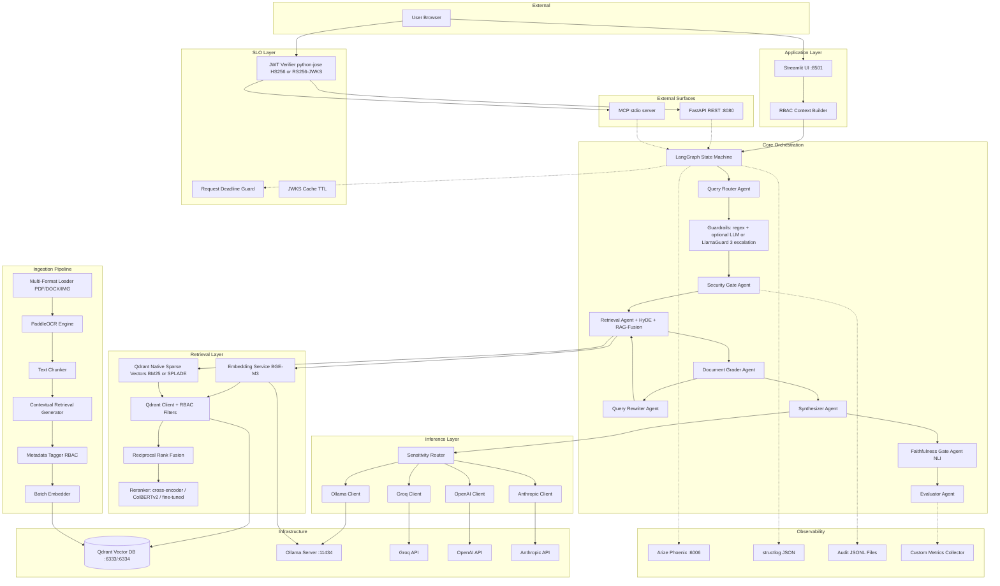
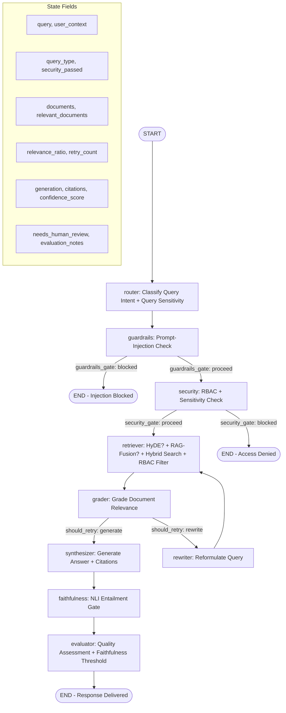
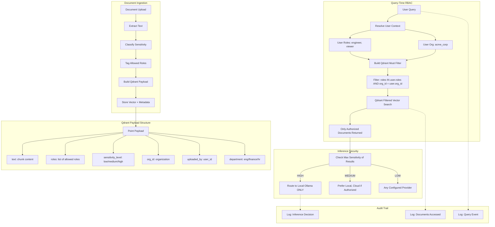
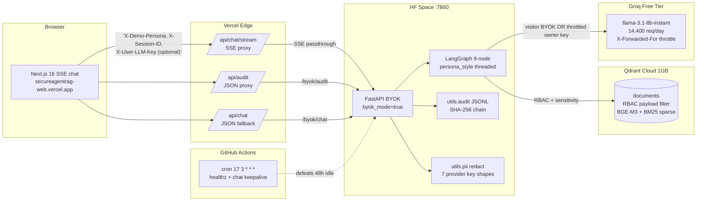
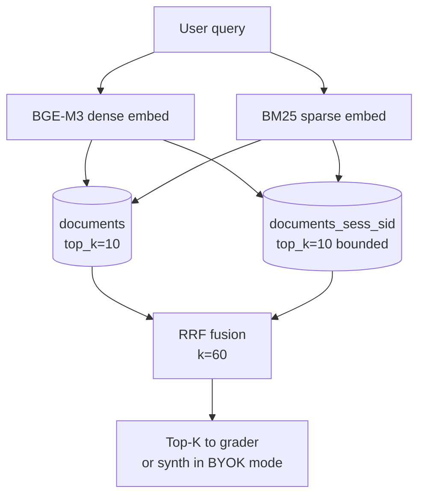

# SecureAgentRAG — Architecture Documentation

> 🚀 **Production topology shipped 2026-05-26..27 on `deploy/prod-launch`.** Sections 1–12 below describe the **local-dev** architecture (everything in docker-compose on one host). **§13** is the live production topology: Vercel Next.js → Hugging Face Space FastAPI → Qdrant Cloud + Groq. Read both when reasoning about the running system.

## 1. System Architecture

Complete system component map showing all services, their communication paths, and data flow from user interaction through document processing.



### Component Descriptions

| Component | Port | Responsibility |
|-----------|------|----------------|
| **Streamlit UI** | 8501 | User interface — chat, document upload, audit viewer, evaluation dashboard |
| **LangGraph Orchestrator** | — | Compiles and executes the multi-agent state machine with checkpointing |
| **Qdrant** | 6333 (REST), 6334 (gRPC) | Vector storage with payload-based RBAC filtering |
| **Ollama** | 11434 | Local LLM inference (Qwen3-8B) and embedding generation (BGE-M3) |
| **Arize Phoenix** | 6006 | OpenTelemetry trace collection and visualization |
| **Audit Logger** | — | JSONL file-based audit trail (one file per day) |

### Data Flow Summary

1. User submits a query through Streamlit
2. RBAC context is constructed from user session (user_id, org_id, roles)
3. LangGraph invokes the pipeline: route → security check → retrieve → grade → synthesize → evaluate
4. Retrieval uses hybrid search (dense + Qdrant native sparse → RRF → reranker). Both paths share the same RBAC payload filter; sparse-only results are already authorised, no post-fusion re-check needed.
5. If relevance is low, the corrective loop rewrites the query and retries
6. Inference router selects local or cloud provider based on data sensitivity
7. Response is returned with citations, confidence score, and evaluation metadata

---

## 2. Multi-Agent Workflow

Detailed LangGraph state machine showing all nodes, conditional edges, and the corrective retrieval loop.



### Node Responsibilities

| Node | Input State | Output State | Logic |
|------|-------------|--------------|-------|
| **router** | `query` | `query_type` | Classifies query as "simple", "complex", or "out_of_scope" |
| **security** | `user_context`, `query_type` | `security_passed`, `security_message` | Validates user roles against required access level |
| **retriever** | `query` (or `rewritten_query`) | `documents` | Performs hybrid search with RBAC filters; populates document list |
| **grader** | `documents` | `relevant_documents`, `relevance_ratio` | Evaluates each document's relevance; computes ratio |
| **rewriter** | `query`, `documents` | `rewritten_query`, `retry_count++` | Generates improved query based on initial results |
| **synthesizer** | `relevant_documents`, `query` | `generation`, `citations`, `confidence_score` | Generates answer with source citations via routed LLM |
| **evaluator** | `generation`, `confidence_score` | `needs_human_review`, `evaluation_notes` | Flags low-confidence responses for human review |

### Conditional Edge Logic

- **`security_gate`**: Returns `"proceed"` if `security_passed == True`, else `"blocked"`
- **`should_retry`**: Returns `"rewrite"` if `relevance_ratio < threshold AND retry_count < max_retries`, else `"generate"`

### Corrective Loop Behavior

The grader-rewriter-retriever cycle ensures retrieval quality:
1. First retrieval attempt with original query
2. Grader evaluates relevance ratio (relevant docs / total docs)
3. If ratio < `SAR_RELEVANCE_THRESHOLD` (default: 0.7) and retries remain, query is rewritten
4. Rewritten query is used for second retrieval attempt
5. Maximum 2 retry cycles (configurable via `max_retries`)
6. After max retries, system proceeds with best available documents

---

## 3. RBAC & Security Model

End-to-end security flow from document ingestion through retrieval filtering to access decisions.



### Security Layers

1. **Authentication**: User identity established at session level (user_id, org_id, roles)
2. **Authorization (RBAC)**: Qdrant payload filters ensure only permitted documents appear in results
3. **Data Isolation**: Multi-tenant org_id filtering prevents cross-organization data leakage
4. **Inference Privacy**: Sensitivity-based routing keeps confidential data on local infrastructure
5. **Audit Compliance**: Every access, query, and routing decision is logged with full context

### Sensitivity-Based Inference Routing

| Data Sensitivity | Allowed Providers | Forced Local | Rationale |
|-----------------|-------------------|--------------|-----------|
| HIGH | Ollama only | Yes | Confidential data must never leave local infrastructure |
| MEDIUM | Ollama (default), Cloud (if authorized) | No | Standard business data; local preferred but cloud acceptable |
| LOW | Any configured provider | No | Public information; optimize for speed/cost |

### RBAC Role Hierarchy

```
admin (full access to all documents and sensitivity levels)
  ├── manager (cross-department, confidential access)
  │     ├── analyst (department-scoped, confidential access)
  │     └── engineer (department-scoped, internal access)
  └── viewer (public + internal documents only)
```

---

## Design Principles

1. **Privacy-First** — All data stays local by default; cloud providers are opt-in fallbacks with sensitivity gates
2. **Defense in Depth** — RBAC enforced at both application logic and vector DB query layers
3. **Corrective by Design** — Built-in quality gates with automatic retry/refinement loops
4. **Observable** — Every decision point is traced, logged, and auditable
5. **Resource-Aware** — Optimized for consumer hardware (8GB VRAM) without sacrificing functionality
6. **Graceful Degradation** — Optional dependencies (Phoenix, Ragas, PaddleOCR) don't break core functionality
7. **Separation of Concerns** — Each agent handles exactly one responsibility in the pipeline

---

## 13. Production topology (live since 2026-05-26)

The public BYOK demo replaces the local Streamlit + Ollama + Postgres + Qdrant docker-compose stack with a $0/month cloud topology. The same FastAPI + LangGraph code runs on both — only the dependencies and entry-point change.



### Cost envelope ($0/month verified)

| Component               | Tier            | Limits in play                                  |
|-------------------------|-----------------|--------------------------------------------------|
| Vercel Hobby            | Free            | 100 GB bandwidth / mo                            |
| Hugging Face Space      | CPU Basic free  | 2 vCPU, 16 GB RAM, 48h idle sleep (cron defeated) |
| Qdrant Cloud free       | 1 GB cluster    | 1 cluster, 4 collections, ~180 chunks resident   |
| Groq llama-3.1-8b       | Free tier       | 14,400 req/day, 6000 TPM, per-IP owner throttle   |
| GitHub Actions          | Free for public | 2000 min/mo (cron uses ~1 min/day)               |

### Streaming + audit invariants (production-only)

- **SSE wire shape** — `event: open | phase | token | blocked | final | error`. Vercel Edge runtime pipes the upstream response body directly so the proxy never buffers. Token deltas reach the browser sub-100ms.
- **Session-scoped audit** — `/byok/audit` filters by `demo-<session_id>` user_id. Sessions cannot read each other's history. The frontend exports the visible rows as `.jsonl` with the SHA-256 `prev_hash` / `entry_hash` chain intact so the recipient can re-verify integrity.
- **X-Forwarded-For trust** — the owner-key per-IP throttle reads the leftmost XFF token (production has a single trusted proxy). Without this fix, every HF visitor would share one bucket.
- **HIGH cloud unlock** — `SAR_ALLOW_CLOUD_FOR_HIGH=true` in `Dockerfile.hf` lets HIGH-classified content synthesize on Groq because the Space has no local Ollama. The frontend labels those answers `sensitivity: high` so the visitor is informed.
- **/readyz BYOK-aware** — skips the Ollama probe, pings `https://api.groq.com/openai/v1/models` with the owner key instead. The keepalive cron's success criterion mirrors what the demo actually depends on.

### 13.1 BYOK upload pipeline (ADR-029)

Visitor PDFs / TXT / MD enter the system through `/byok/uploads` and land in a per-session Qdrant collection — never the shared base.

```mermaid
graph LR
    subgraph Browser
        Drop[react-dropzone drag-drop]
        Drawer[Uploads drawer<br/>list + delete]
    end

    subgraph Vercel Edge
        EUp[/api/uploads<br/>duplex: half multipart/]
    end

    subgraph HF Space
        Endpoint[/byok/uploads/<br/>POST 5MB · 5 files · 60 chunks]
        Pipe[ingestion/pipeline<br/>chunker → BGE-M3 → upsert]
        Validate[size + ext + chunk caps<br/>413 / 422 on reject]
    end

    subgraph Qdrant Cloud
        Sess[(documents_sess_sid<br/>dense + bm25 sparse<br/>same RBAC filter)]
    end

    Drop --> EUp
    EUp -- "X-Session-ID, file" --> Endpoint
    Endpoint --> Validate
    Validate -- "OK" --> Pipe
    Pipe --> Sess
    Drawer -- "GET /byok/uploads" --> Endpoint
    Drawer -- "DELETE /byok/uploads/file_id" --> Endpoint
```

**Dual-collection retrieval.** Every chat fans out to base ∪ session collections in parallel for both dense and sparse, then RRF-fuses the four result sets:



The session collection's `top_k` is bounded by `SAR_TOP_K` (not `*2`) to keep the candidate set tight — visitor uploads should *augment* base corpus, not drown it.

### 13.2 Persona presets (`_DEMO_PERSONAS`)

`X-Demo-Persona` header maps to one of three pre-baked RBAC profiles in `interfaces/api.py`. Selected fields below:

| Persona | Clearance | Roles | Synth style |
|---|---|---|---|
| `engineer` | 2 | `engineering`, `viewer` | Direct, code-snippet ready, kubectl-friendly |
| `compliance` | 3 | `compliance`, `legal`, `viewer` | Cite policy IDs, formal tone, flag uncertainty |
| `executive` | 3 | `executive`, `compliance`, `engineering`, `viewer` | High-level, bullet-first, decision-ready |

`persona_style` rides on `GraphState` from the request through to `synthesizer._build_system_prompt`, where it becomes a system-prompt suffix. The RBAC filter on `clearance + roles` is applied at Qdrant query time, so two personas asking the same query see different citation chips on the frontend.

### 13.3 Cost-optimisation toggles (ADR-030)

Each toggle in `Dockerfile.hf` represents a Groq call eliminated from the pipeline. The full table:

| Toggle | Default (BYOK prod) | Calls saved/chat |
|---|---|---|
| `SAR_GROQ_MODEL=llama-3.1-8b-instant` | pinned | – (faster, more TPM headroom) |
| `SAR_RAG_FUSION_ENABLED=false` | off | -1 (no reformulation LLM call) |
| `SAR_BYOK_SKIP_EVALUATOR=true` | on | -1 (heuristic confidence) |
| `SAR_BYOK_SKIP_GRADER=true` | on | -N (no per-doc LLM grade, N ≈ top_k) |
| `SAR_FAITHFULNESS_GATE_ENABLED=false` | off | -5..10 (no per-sentence NLI) |
| `SAR_RERANKER_TYPE=none` | off | – (no cross-encoder; CPU disk budget) |
| router short-query shortcut (≤80 chars) | on | -1 (no classifier LLM) |
| `SAR_MAX_RETRIES=1` | capped | -1 (no second rewrite) |

**Before:** ~5–6 Groq calls/chat. **After:** ~2 calls/chat (router shortcut + synth). The 30 RPM free-tier budget survives sustained traffic.

### 13.4 Privacy narrative under BYOK mode

The hero claim "HIGH never leaves local Ollama" is **true in self-hosted mode**. The live BYOK demo runs without Ollama (HF Space CPU Basic has no LLM) and explicitly sets `SAR_ALLOW_CLOUD_FOR_HIGH=true` so HIGH-classified content can synthesize on Groq.

The frontend renders a `sensitivity: high` badge whenever this happens — the visitor is informed that *for this query, on this deployment, HIGH data was routed to cloud*. Audit row records `synth_provider=groq` and `forced_local=false` for full provenance.

**Recovery path for self-hosted deploys:** unset `SAR_ALLOW_CLOUD_FOR_HIGH` (defaults to `false`). HIGH-classified content will then refuse on the BYOK demo because no Ollama is available; the public demo would lose its HIGH-content answer capability. That's the intended trade — the demo prioritises showing the full pipeline; production deploys prioritise the privacy guarantee.

### 13.5 Public metadata endpoints (the transparency layer)

Two read-only public endpoints surface backend state to the frontend's
`/corpus` and `/personas` pages. No auth, no BYOK key, no PII. They
exist so the frontend never hard-codes a value that could drift from
the server-side dispatch.

| Endpoint | Returns | Backed by |
|---|---|---|
| `GET /byok/personas` | The three demo RBAC presets (`engineer`, `compliance`, `executive`) with `clearance_level`, `roles`, `style`, plus the `org_id` + `default` persona. | `_DEMO_PERSONAS` in `interfaces/api.py` — same dict that powers `_persona_to_user_ctx`. |
| `GET /byok/corpus` | One row per source file in the base `documents` collection: `source_file` (basename), `chunks`, `sensitivity_level`, `roles` (union across chunks). Never includes chunk text — defense-in-depth regression test guards this. | Scrolls the root tenant Qdrant collection (up to 4 pages of 256), groups by `source_file`, role-unions chunks. Fails open on Qdrant outage. |

Frontend pages consume them via thin Vercel Edge proxies at
`/api/corpus` and `/api/personas`. Pages are server-rendered at request
time with `dynamic = "force-dynamic"` so cold backends never poison a
cached HTML response.

### 13.6 Frontend product surface (Y-series, 2026-05-27)

The Vercel deploy now serves five routes plus seven Edge proxies:

| Route | Render | Purpose |
|---|---|---|
| `/` | static | Landing page — hero, four-feature card grid, six-step walkthrough, corpus/personas/status link grid, by-the-numbers stats. CTA → `/chat`. |
| `/chat` | static + client | The BYOK chat UI itself. Was the home page until 2026-05-27 — moved out so first-time visitors get context before the chat surface loads. |
| `/corpus` | SSR | Live table of the 10 demo docs from `/byok/corpus`. |
| `/personas` | SSR | Live RBAC inspector from `/byok/personas`. |
| `/status` | client | Live health probes for Vercel Edge + HF Space `/healthz` + `/readyz` + Edge proxy, polled every 30 s. |
| `/api/chat` · `/api/chat/stream` · `/api/audit` · `/api/uploads` · `/api/uploads/[fileId]` · `/api/corpus` · `/api/personas` | Edge | Thin proxies → backend `/byok/*` endpoints. |

**Cold-start warmer.** `/api/chat` fires a fire-and-forget GET to the HF
Space `/healthz` at module load. A freshly cold Vercel Edge instance
nudges the backend awake while the visitor is still typing, dropping
the visible 30–60 s cold-start tax to ~1 s by the time the user hits
Send.

**Suggested follow-up chips.** Each assistant turn with citations
renders 3 chips below the citations panel: 2 templated from distinct
citation filenames (`Tell me more about <stem>`) plus 1 persona-
flavoured generic prompt. Zero LLM calls — pure client-side string
templating. Engagement boost without burning Groq budget.
