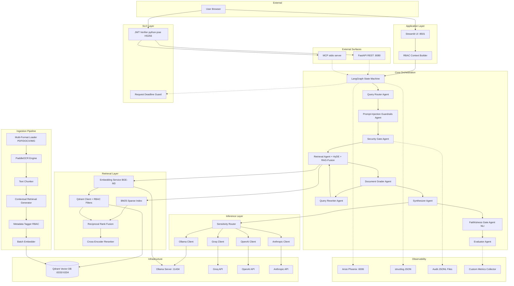
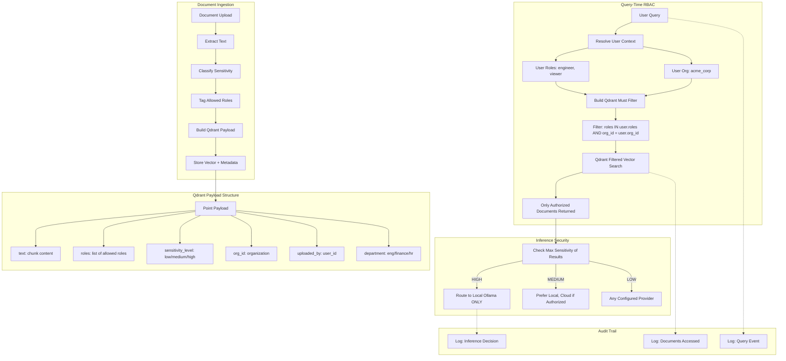

# SecureAgentRAG — Architecture Documentation

## 1. System Architecture

Complete system component map showing all services, their communication paths, and data flow from user interaction through document processing.



### Component Descriptions

| Component | Port | Responsibility |
|-----------|------|----------------|
| **Streamlit UI** | 8501 | User interface — chat, document upload, audit viewer, evaluation dashboard |
| **LangGraph Orchestrator** | — | Compiles and executes the multi-agent state machine with checkpointing |
| **Qdrant** | 6333 (REST), 6334 (gRPC) | Vector storage with payload-based RBAC filtering |
| **Ollama** | 11434 | Local LLM inference (Qwen3-8B) and embedding generation (BGE-M3) |
| **Arize Phoenix** | 6006 | OpenTelemetry trace collection and visualization |
| **Audit Logger** | — | JSONL file-based audit trail (one file per day) |

### Data Flow Summary

1. User submits a query through Streamlit
2. RBAC context is constructed from user session (user_id, org_id, roles)
3. LangGraph invokes the pipeline: route → security check → retrieve → grade → synthesize → evaluate
4. Retrieval uses hybrid search (dense + BM25 → RRF → reranker) with RBAC filters
5. If relevance is low, the corrective loop rewrites the query and retries
6. Inference router selects local or cloud provider based on data sensitivity
7. Response is returned with citations, confidence score, and evaluation metadata

---

## 2. Multi-Agent Workflow

Detailed LangGraph state machine showing all nodes, conditional edges, and the corrective retrieval loop.


### Node Responsibilities

| Node | Input State | Output State | Logic |
|------|-------------|--------------|-------|
| **router** | `query` | `query_type` | Classifies query as "simple", "complex", or "out_of_scope" |
| **security** | `user_context`, `query_type` | `security_passed`, `security_message` | Validates user roles against required access level |
| **retriever** | `query` (or `rewritten_query`) | `documents` | Performs hybrid search with RBAC filters; populates document list |
| **grader** | `documents` | `relevant_documents`, `relevance_ratio` | Evaluates each document's relevance; computes ratio |
| **rewriter** | `query`, `documents` | `rewritten_query`, `retry_count++` | Generates improved query based on initial results |
| **synthesizer** | `relevant_documents`, `query` | `generation`, `citations`, `confidence_score` | Generates answer with source citations via routed LLM |
| **evaluator** | `generation`, `confidence_score` | `needs_human_review`, `evaluation_notes` | Flags low-confidence responses for human review |

### Conditional Edge Logic

- **`security_gate`**: Returns `"proceed"` if `security_passed == True`, else `"blocked"`
- **`should_retry`**: Returns `"rewrite"` if `relevance_ratio < threshold AND retry_count < max_retries`, else `"generate"`

### Corrective Loop Behavior

The grader-rewriter-retriever cycle ensures retrieval quality:
1. First retrieval attempt with original query
2. Grader evaluates relevance ratio (relevant docs / total docs)
3. If ratio < `SAR_RELEVANCE_THRESHOLD` (default: 0.7) and retries remain, query is rewritten
4. Rewritten query is used for second retrieval attempt
5. Maximum 2 retry cycles (configurable via `max_retries`)
6. After max retries, system proceeds with best available documents

---

## 3. RBAC & Security Model

End-to-end security flow from document ingestion through retrieval filtering to access decisions.



### Security Layers

1. **Authentication**: User identity established at session level (user_id, org_id, roles)
2. **Authorization (RBAC)**: Qdrant payload filters ensure only permitted documents appear in results
3. **Data Isolation**: Multi-tenant org_id filtering prevents cross-organization data leakage
4. **Inference Privacy**: Sensitivity-based routing keeps confidential data on local infrastructure
5. **Audit Compliance**: Every access, query, and routing decision is logged with full context

### Sensitivity-Based Inference Routing

| Data Sensitivity | Allowed Providers | Forced Local | Rationale |
|-----------------|-------------------|--------------|-----------|
| HIGH | Ollama only | Yes | Confidential data must never leave local infrastructure |
| MEDIUM | Ollama (default), Cloud (if authorized) | No | Standard business data; local preferred but cloud acceptable |
| LOW | Any configured provider | No | Public information; optimize for speed/cost |

### RBAC Role Hierarchy

```
admin (full access to all documents and sensitivity levels)
  ├── manager (cross-department, confidential access)
  │     ├── analyst (department-scoped, confidential access)
  │     └── engineer (department-scoped, internal access)
  └── viewer (public + internal documents only)
```

---

## Design Principles

1. **Privacy-First** — All data stays local by default; cloud providers are opt-in fallbacks with sensitivity gates
2. **Defense in Depth** — RBAC enforced at both application logic and vector DB query layers
3. **Corrective by Design** — Built-in quality gates with automatic retry/refinement loops
4. **Observable** — Every decision point is traced, logged, and auditable
5. **Resource-Aware** — Optimized for consumer hardware (8GB VRAM) without sacrificing functionality
6. **Graceful Degradation** — Optional dependencies (Phoenix, Ragas, PaddleOCR) don't break core functionality
7. **Separation of Concerns** — Each agent handles exactly one responsibility in the pipeline
